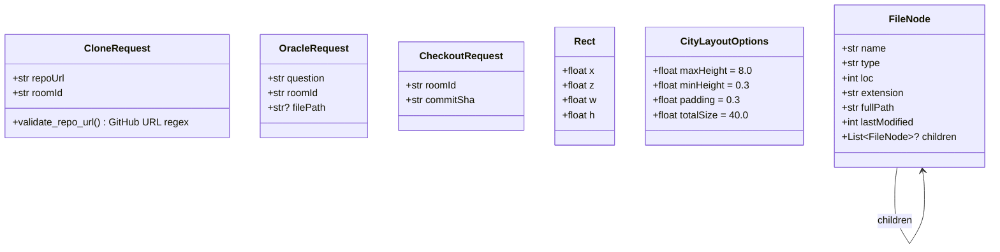
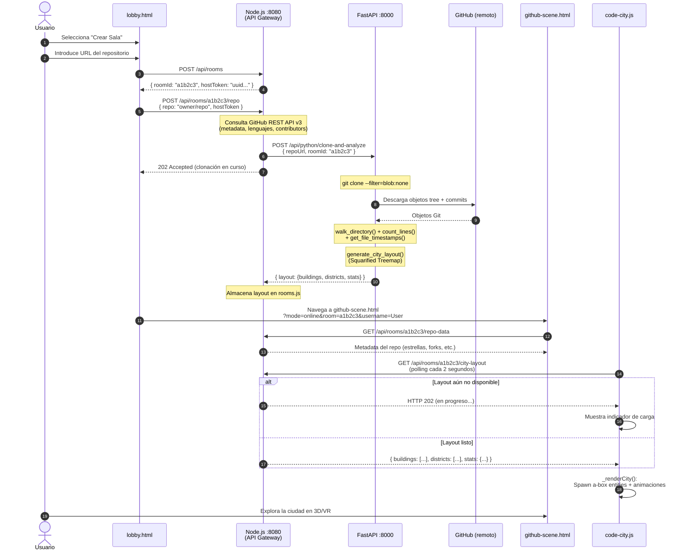
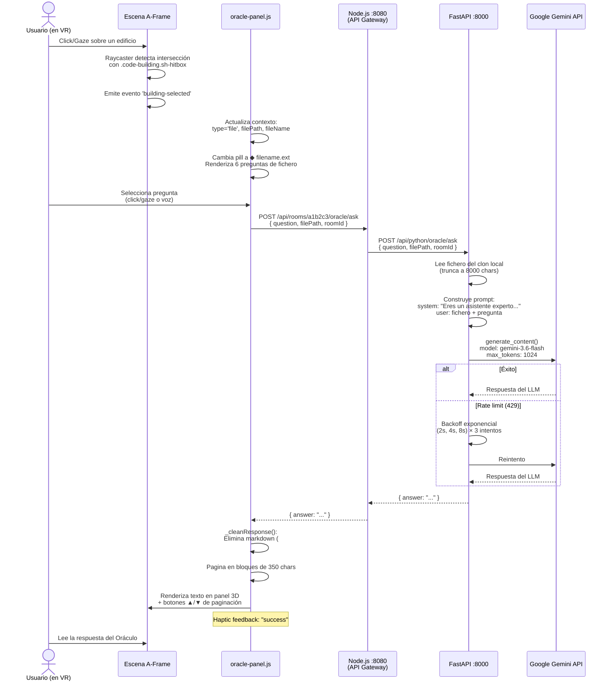

# Documento de Arquitectura y Topología del Sistema

## VR Code City — Trabajo de Fin de Grado

**Autor:** Carlos Malagón Tenorio  
**Repositorio:** [github.com/mtcarlos/TFG](https://github.com/mtcarlos/TFG)  
**Fecha de revisión:** septiembre de 2026  
**Versión del documento:** 2.0

---

## Tabla de Contenidos

1. [Visión General de la Arquitectura y Topología](#1-visión-general-de-la-arquitectura-y-topología)
2. [Inventario Detallado de Servidores y Servicios](#2-inventario-detallado-de-servidores-y-servicios)
3. [Flujos de Comunicación y Funcionamiento Interno](#3-flujos-de-comunicación-y-funcionamiento-interno)
4. [Estudio de Independencia y Desacoplamiento de Servicios](#4-estudio-de-independencia-y-desacoplamiento-de-servicios)
5. [Justificación de las Decisiones de Diseño](#5-justificación-de-las-decisiones-de-diseño)
6. [Configuración de Puertos y Guía de Arranque](#6-configuración-de-puertos-y-guía-de-arranque)

---

## 1. Visión General de la Arquitectura y Topología

### 1.1 Resumen Ejecutivo

VR Code City implementa una **arquitectura de tres capas lógicamente desacopladas** diseñada para transformar repositorios de código fuente alojados en GitHub en ciudades tridimensionales navegables mediante WebXR. La plataforma permite la exploración colaborativa en tiempo real de estructuras de software utilizando la metáfora de visualización *Code City* (Wettel & Lanza, 2007), complementada por un asistente de inteligencia artificial contextual denominado *El Oráculo*.

La separación arquitectónica responde a tres dominios funcionales claramente diferenciados:

| Capa | Dominio Funcional | Tecnología Primaria |
|------|-------------------|---------------------|
| **Presentación Espacial** | Renderizado WebXR, generación procedural de geometría, interacción inmersiva | A-Frame 1.6.0, Three.js, WebGL, WebXR Device API |
| **Orquestación y Gateway** | Señalización WebRTC, gestión de salas, proxy API, entrega de activos estáticos, integración GitHub REST API | Node.js, Express, Socket.IO, Open-EasyRTC |
| **Motor Computacional** | Clonación y análisis de repositorios Git, algoritmo de *treemap squarified*, pasarela LLM (Google Gemini) | Python, FastAPI, Uvicorn, Google GenAI SDK |

Esta división tripartita no es meramente conceptual: cada capa se materializa en un **proceso de ejecución independiente** con su propio espacio de direcciones, puerto de red y ciclo de vida, lo que confiere al sistema propiedades de resiliencia, escalabilidad horizontal y mantenibilidad que se analizan en profundidad en la §4.

> [!IMPORTANT]
> **Patrón de comunicación: API Gateway.** A diferencia de una arquitectura en la que el navegador consume directamente ambos backends, VR Code City implementa un patrón **API Gateway**: el servidor Node.js actúa como *proxy inverso* (*reverse proxy*) del microservicio Python. El cliente solo se comunica con el puerto 8080 (Node.js); las peticiones de análisis, Oracle y Time Machine se encaminan internamente hacia el puerto 8000 (Python) de forma transparente para el frontend.

### 1.2 Diagrama de Arquitectura General

```mermaid
graph TB
    subgraph "Cliente WebXR (Navegador / Visor VR)"
        LANDING["index.html<br/>Portal 3D de Mundos"]
        LOBBY["lobby.html<br/>Configuración de Sesión"]
        SCENE["github-scene.html<br/>Escena A-Frame WebXR"]
        CODECITY["code-city.js<br/>Renderer Code City"]
        ORACLE_UI["oracle-panel.js<br/>Panel IA + Voz"]
        LOADER["SceneDataLoader.js<br/>Ingesta Datos"]
        NAF["Networked-Aframe<br/>Sincronización P2P"]
        WRISTL["vr-wrist-menu.js<br/>Árbol de Ficheros VR"]
        WRISTR["vr-right-wrist-menu.js<br/>Controles de Escala"]
        DASHBOARD["vr-dashboard-panel.js<br/>Dashboard + Time Machine"]
    end

    subgraph "Servidor 1 — Node.js (Puerto 8080)"
        EXPRESS["Express.js<br/>Servidor HTTP + API Gateway"]
        SOCKETIO["Socket.IO<br/>WebSockets Persistentes"]
        EASYRTC["Open-EasyRTC<br/>Señalización WebRTC"]
        ROOMS["rooms.js<br/>Estado de Salas en Memoria"]
        GHCLIENT["githubClient.js<br/>GitHub REST API v3"]
        GHMAPPER["githubDataMapper.js<br/>Datasets BabiaXR"]
    end

    subgraph "Servidor 2 — Python (Puerto 8000)"
        FASTAPI["FastAPI + Uvicorn<br/>API REST Asíncrona"]
        ANALYZER["analyzer.py<br/>Git Clone + LOC + Timestamps"]
        LAYOUT["city_layout.py<br/>Squarified Treemap"]
        ORACLEMOD["oracle.py<br/>Agente Gemini LLM"]
        CONFIG["config.py<br/>Configuración Central"]
    end

    subgraph "Servicios Externos"
        GITHUB["GitHub<br/>Git Protocol + REST API v3"]
        STUN["Google STUN Servers<br/>stun1-4.l.google.com:19302"]
        GEMINI["Google Gemini API<br/>gemini-3.6-flash"]
    end

    LANDING --> LOBBY
    LOBBY --> SCENE
    SCENE --> CODECITY
    SCENE --> ORACLE_UI
    SCENE --> LOADER
    SCENE --> NAF
    SCENE --> DASHBOARD

    NAF -- "WebSocket<br/>Señalización SDP/ICE" --> SOCKETIO
    SOCKETIO <--> EASYRTC
    NAF -- "P2P WebRTC<br/>DataChannel + Audio" -.-> NAF

    LOBBY -- "POST /api/rooms<br/>POST /api/rooms/:id/repo" --> EXPRESS
    LOADER -- "GET /api/rooms/:id/city-layout<br/>(polling cada 2s)" --> EXPRESS
    ORACLE_UI -- "POST /api/rooms/:id/oracle/ask" --> EXPRESS
    DASHBOARD -- "GET /api/rooms/:id/commits<br/>POST /api/rooms/:id/checkout" --> EXPRESS

    EXPRESS -- "Proxy HTTP interno" --> FASTAPI
    FASTAPI --> ANALYZER
    ANALYZER --> LAYOUT
    FASTAPI --> ORACLEMOD

    ANALYZER -- "git clone --filter=blob:none" --> GITHUB
    GHCLIENT -- "REST API v3" --> GITHUB
    ORACLEMOD -- "google-genai SDK" --> GEMINI
    EASYRTC -- "ICE Candidates" --> STUN

    EXPRESS -- "Activos Estáticos<br/>HTML/CSS/JS/GLB" --> SCENE

    EASYRTC --> ROOMS

    style SCENE fill:#4a90d9,color:#fff
    style EXPRESS fill:#68a063,color:#fff
    style FASTAPI fill:#009688,color:#fff
    style GITHUB fill:#333,color:#fff
    style STUN fill:#f57c00,color:#fff
    style GEMINI fill:#7b1fa2,color:#fff
```

---

## 2. Inventario Detallado de Servidores y Servicios

### 2.1 Servidor 1: Node.js / Express — API Gateway, Servidor Web y Señalización en Tiempo Real

| Atributo | Valor |
|----------|-------|
| **Punto de entrada** | [`server/easyrtc-server.js`](file:///c:/Users/mtcar/OneDrive/Desktop/TFG/server/easyrtc-server.js) (467 líneas) |
| **Runtime** | Node.js ≥ 18.0.0 |
| **Puerto por defecto** | `8080` (configurable vía `PORT`) |
| **Protocolos** | HTTP/1.1, WebSocket (Socket.IO), WebRTC signaling |
| **Título de proceso** | `networked-aframe-server` |

#### 2.1.1 Pila Tecnológica

| Dependencia | Versión | Función |
|-------------|---------|---------|
| `networked-aframe` | ^0.14.0 | Meta-paquete que incluye `express`, `socket.io` y `open-easyrtc` como dependencias transitivas |
| `express` | ^4.17.3 | Framework HTTP para servicio de activos estáticos, API REST y proxy |
| `socket.io` | ^4.8.1 | Capa de transporte bidireccional persistente (WebSocket con *fallback* a *long-polling*) |
| `open-easyrtc` | ^2.1.0 | Servidor de señalización WebRTC: intercambio de ofertas/respuestas SDP y candidatos ICE |
| `dotenv` | ^17.4.2 | Carga de variables de entorno desde fichero `.env` |
| `simple-git` | ^3.36.0 | Interfaz Node.js para operaciones Git (módulo legacy, uso residual) |

#### 2.1.2 Responsabilidades Funcionales

**a) Servidor de activos estáticos.**  
Express sirve el directorio raíz completo del proyecto como contenido estático (`express.static(path.resolve(__dirname, '..'))`), incluyendo las páginas HTML del portal ([`index.html`](file:///c:/Users/mtcar/OneDrive/Desktop/TFG/index.html)), el lobby ([`lobby.html`](file:///c:/Users/mtcar/OneDrive/Desktop/TFG/lobby.html)), las escenas 3D ([`scenes/github-scene.html`](file:///c:/Users/mtcar/OneDrive/Desktop/TFG/scenes/github-scene.html), [`scenes/babia.html`](file:///c:/Users/mtcar/OneDrive/Desktop/TFG/scenes/babia.html), [`scenes/scene.html`](file:///c:/Users/mtcar/OneDrive/Desktop/TFG/scenes/scene.html)), hojas de estilo, módulos JavaScript, modelos 3D GLB/glTF, fuentes MSDF, texturas, sonidos y los bundles precompilados de Networked-Aframe (`dist/`).

**b) API Gateway (proxy inverso hacia Python).**  
El servidor Node.js expone una **superficie API de 12+ endpoints REST** que encapsulan toda la comunicación con el microservicio Python. El cliente nunca accede directamente al puerto 8000; Node.js actúa como fachada unificada:

| Endpoint Node.js | Método | Comportamiento | Proxy hacia Python |
|------------------|--------|----------------|-------------------|
| `/api/status` | GET | Estado del sistema: salas activas, usuarios conectados | — (local) |
| `/api/rooms` | POST | Creación de sala: genera `roomId` (6 chars) + `hostToken` (UUID) | — (local) |
| `/api/rooms/:roomId` | GET | Estado público de la sala | — (local) |
| `/api/rooms/:roomId/repo` | POST | Host asigna repositorio → carga metadata GitHub → invoca análisis Python | `POST /api/python/clone-and-analyze` |
| `/api/rooms/:roomId/repo-data` | GET | Retorna metadata procesada del repositorio | — (local) |
| `/api/rooms/:roomId/dataset/:name` | GET | Datasets BabiaXR (`languages`, `contributors`, `summary`) | — (local) |
| `/api/rooms/:roomId/repo-clone` | POST | Trigger explícito de clonación + layout | `POST /api/python/clone-and-analyze` |
| `/api/rooms/:roomId/city-layout` | GET | Layout 3D de edificios y distritos | — (local, datos precalculados) |
| `/api/rooms/:roomId/commits` | GET | Historial de commits (*Time Machine*) | `GET /api/python/commits/{roomId}` |
| `/api/rooms/:roomId/checkout` | POST | Checkout temporal a commit específico | `POST /api/python/checkout` |
| `/api/rooms/:roomId/oracle/ask` | POST | Consulta al Oráculo IA | `POST /api/python/oracle/ask` |

**c) Integración con GitHub REST API v3.**  
El módulo [`server/githubClient.js`](file:///c:/Users/mtcar/OneDrive/Desktop/TFG/server/githubClient.js) (150 líneas) consume la API de GitHub para obtener metadata del repositorio (estrellas, forks, descripción), distribución de lenguajes de programación y lista de contribuidores. El módulo [`server/githubDataMapper.js`](file:///c:/Users/mtcar/OneDrive/Desktop/TFG/server/githubDataMapper.js) (90 líneas) normaliza estos datos en datasets estructurados para los gráficos BabiaXR del museo 3D (diagramas de barras de lenguajes, gráficos circulares de contribuidores, métricas resumidas). La variable de entorno `GITHUB_TOKEN` permite autenticación para incrementar el límite de tasa de 60 a 5.000 peticiones/hora.

**d) Canal de señalización WebRTC.**  
Open-EasyRTC se integra como *middleware* sobre Socket.IO, interceptando los eventos de señalización para orquestar el establecimiento de conexiones *peer-to-peer* entre clientes:

- Recibe ofertas SDP (*Session Description Protocol*) del par iniciador.
- Retransmite la oferta al par destino, que genera y devuelve una respuesta SDP.
- Intercambia candidatos ICE (*Interactive Connectivity Establishment*) para la negociación de la ruta de red óptima.
- Configura servidores STUN de Google (`stun:stun1.l.google.com:19302` y `stun:stun2.l.google.com:19302`) para el descubrimiento de direcciones IP públicas y la traversal de NAT.

**e) Gestión de salas colaborativas (*rooms*).**  
El módulo [`server/rooms.js`](file:///c:/Users/mtcar/OneDrive/Desktop/TFG/server/rooms.js) (155 líneas) mantiene un `Map` en memoria con el estado de cada sala:

```
{ roomId, hostToken, repo, repoData, clonePath, cloneStatus, cityLayout, createdAt }
```

Las salas dinámicas usan el prefijo `github-{roomId}` en el espacio de nombres de EasyRTC. El servidor implementa **tres *hooks* de ciclo de vida** de EasyRTC:

1. **`easyrtcAuth`** — Almacena credenciales del cliente (nombre de usuario) en el contexto de conexión.
2. **`roomJoin`** — Registra al usuario en `activeRoomsTracker` con su nombre y sala.
3. **`roomLeave` / `disconnect`** — Elimina al usuario del registro de presencia. Si el contador de usuarios de una sala `github-*` llega a cero, **despacha automáticamente una petición** `DELETE /api/python/rooms/{roomId}` al microservicio Python para la recolección de basura (*garbage collection*) del repositorio clonado en disco.

**f) Endpoint de presencia para el portal.**  
`GET /api/status` retorna el mapa de salas activas y usuarios conectados, consumido por el *landing page* ([`index.html`](file:///c:/Users/mtcar/OneDrive/Desktop/TFG/index.html)) mediante polling cada 4 segundos para mostrar indicadores de presencia en vivo ("X explorando", "Y analizando").

#### 2.1.3 Modelo de Ejecución

Node.js opera sobre un **bucle de eventos (*event-loop*) monohilo y no bloqueante**, modelo idóneo para manejar un elevado número de conexiones WebSocket concurrentes con baja latencia. Las operaciones de E/S se delegan a *libuv*, que gestiona un *pool* de hilos para operaciones del sistema operativo. Las llamadas HTTP proxy hacia el microservicio Python se ejecutan como operaciones asíncronas mediante `fetch()`, sin bloquear el hilo principal.

El servidor soporta configuración opcional de HTTPS mediante certificados SSL (líneas 18-22 y 357), requisito para activar la WebXR Device API en visores independientes como Meta Quest.

---

### 2.2 Servidor 2: Python / FastAPI — Microservicio de Ingesta, Análisis Git e IA

| Atributo | Valor |
|----------|-------|
| **Punto de entrada** | [`python-service/main.py`](file:///c:/Users/mtcar/OneDrive/Desktop/TFG/python-service/main.py) (246 líneas) |
| **Módulos de soporte** | [`analyzer.py`](file:///c:/Users/mtcar/OneDrive/Desktop/TFG/python-service/analyzer.py), [`city_layout.py`](file:///c:/Users/mtcar/OneDrive/Desktop/TFG/python-service/city_layout.py), [`oracle.py`](file:///c:/Users/mtcar/OneDrive/Desktop/TFG/python-service/oracle.py), [`config.py`](file:///c:/Users/mtcar/OneDrive/Desktop/TFG/python-service/config.py) |
| **Runtime** | Python ≥ 3.10 |
| **Puerto por defecto** | `8000` (configurable vía `PYTHON_PORT`) |
| **Protocolo** | HTTP/1.1 (REST entrante), HTTPS (saliente a Google Gemini API) |

#### 2.2.1 Pila Tecnológica

| Dependencia | Versión | Función |
|-------------|---------|---------|
| `fastapi` | ≥ 0.115.0 | Framework ASGI con generación automática de esquema OpenAPI |
| `uvicorn[standard]` | ≥ 0.30.0 | Servidor ASGI de alto rendimiento con soporte `uvloop` y `httptools` |
| `google-genai` | ≥ 1.0.0 | SDK oficial de Google para la API de Gemini (inferencia LLM) |
| `python-dotenv` | ≥ 1.0.0 | Carga de variables de entorno desde fichero `.env` |

#### 2.2.2 Superficie de la API REST

El microservicio expone cinco endpoints, todos con validación de entrada mediante Pydantic y documentación OpenAPI autogenerada (accesible en `/docs`):

| Método | Endpoint | Entrada (Pydantic) | Función |
|--------|----------|---------------------|---------|
| `POST` | `/api/python/clone-and-analyze` | `CloneRequest(repoUrl, roomId)` | Clonación parcial *blobless*, recorrido de directorio, cómputo de LOC y timestamps, generación del layout *treemap squarified* |
| `POST` | `/api/python/oracle/ask` | `OracleRequest(question, roomId, filePath?)` | Lectura de fichero o README, construcción de prompt contextual, invocación de Google Gemini con *backoff* exponencial |
| `GET` | `/api/python/commits/{room_id}` | Path param `room_id` | Obtención de los últimos 50 commits con hash, autor, fecha y mensaje |
| `POST` | `/api/python/checkout` | `CheckoutRequest(roomId, commitSha)` | Checkout asíncrono del commit, re-análisis del árbol y regeneración del layout 3D |
| `DELETE` | `/api/python/rooms/{room_id}` | Path param `room_id` | Recolección de basura: eliminación del directorio clonado y limpieza de estado en memoria |

#### 2.2.3 Responsabilidades Funcionales

**a) Clonación parcial optimizada de repositorios** ([`analyzer.py`](file:///c:/Users/mtcar/OneDrive/Desktop/TFG/python-service/analyzer.py), función `clone_repo`).  
El módulo de ingesta utiliza `git clone --filter=blob:none`, una operación de **clonación parcial** (*partial clone*, Git ≥ 2.22) que descarga exclusivamente los objetos de tipo *commit* y *tree* (estructura de directorios y metadatos históricos), difiriendo la descarga de *blobs* (contenido de ficheros) al momento del *checkout* del *working tree*. Esto reduce drásticamente el ancho de banda y el tiempo de clonación inicial, al mismo tiempo que preserva el 100% del historial de commits para la funcionalidad *Time Machine*.

El directorio de clonación es `python-service/tmp/{roomId}`. Si existe un clon previo para la misma sala, se elimina previamente con `shutil.rmtree` (con manejo especial para Windows: los ficheros *pack* de Git se marcan como solo lectura, requiriendo `os.chmod(path, stat.S_IWRITE)` antes de la eliminación).

**b) Extracción de timestamps Git para el Modo Rayos X** ([`analyzer.py`](file:///c:/Users/mtcar/OneDrive/Desktop/TFG/python-service/analyzer.py), función `get_file_timestamps`).  
Para alimentar el mapa de calor temporal del *X-Ray Mode*, el servicio ejecuta:

```bash
git log --name-only --pretty=format:commit:%ct
```

Este comando produce un flujo donde cada commit se precede por su timestamp Unix (`%ct`). El parser recorre el flujo cronológicamente inverso (más reciente primero), registrando la **primera aparición** de cada ruta de fichero como su timestamp de última modificación. Este timestamp se adjunta a cada nodo del árbol como `lastModified` (en milisegundos Unix).

**c) Recorrido del árbol de directorios y métricas LOC** ([`analyzer.py`](file:///c:/Users/mtcar/OneDrive/Desktop/TFG/python-service/analyzer.py), función `walk_directory`).  
La función recorre recursivamente el sistema de ficheros del repositorio clonado, generando nodos con:

```json
{
  "name": "analyzer.py",
  "type": "file",
  "loc": 379,
  "extension": ".py",
  "fullPath": "python-service/analyzer.py",
  "lastModified": 1727189100000
}
```

Se aplican dos filtros de exclusión:
- **Directorios ignorados:** `.git`, `node_modules`, `dist`, `build`, `.next`, `__pycache__`, `vendor`, `.venv`, `target`.
- **Extensiones binarias:** imágenes, audio, vídeo, archivos comprimidos, fuentes y binarios compilados (`.png`, `.jpg`, `.woff`, `.zip`, `.exe`, `.dll`, etc.).

El conteo de LOC emplea un criterio de **líneas no vacías** (`sum(1 for line in f if line.strip())`), descartando líneas en blanco, con lectura UTF-8 tolerante a errores (`errors="ignore"`).

**d) Algoritmo de layout *Squarified Treemap*** ([`city_layout.py`](file:///c:/Users/mtcar/OneDrive/Desktop/TFG/python-service/city_layout.py)).  
Este módulo implementa el **algoritmo de *treemap squarified*** (Bruls, Huizing & van Wijk, 2000), que distribuye los edificios de la ciudad en el plano XZ optimizando la relación de aspecto (*aspect ratio*) para evitar rectángulos excesivamente alargados. El algoritmo opera iterativamente sobre el lado más corto del rectángulo disponible.

La altura de los edificios se calcula mediante una escala de raíz cuadrada para evitar que ficheros muy grandes dominen visualmente:

$$\text{normalized} = \frac{\sqrt{\text{loc}}}{\sqrt{\text{maxLOC}}}$$

$$\text{height} = \text{minHeight} + \text{normalized} \times (\text{maxHeight} - \text{minHeight})$$

Donde `minHeight = 0.3` y `maxHeight = 8.0` por defecto (configurable vía `CityLayoutOptions`).

La salida del módulo es un JSON con tres bloques:
- `buildings`: Array de objetos con posición 3D (`x`, `y`, `z`), dimensiones (`width`, `depth`, `height`), color por extensión, LOC y timestamp.
- `districts`: Array de plataformas de directorio con posición y dimensiones.
- `stats`: Métricas agregadas (`totalFiles`, `totalLOC`, `totalDirs`).

**e) Pasarela resiliente con Google Gemini — El Oráculo** ([`oracle.py`](file:///c:/Users/mtcar/OneDrive/Desktop/TFG/python-service/oracle.py)).  
El módulo implementa la integración con el modelo `gemini-3.6-flash` mediante el SDK oficial `google-genai`:

1. **Prompt del sistema** (en español): *"Eres un asistente experto en código. Responde de forma concisa y clara en español. No uses markdown excesivo, mantén la respuesta breve (máximo 300 palabras)."*

2. **Inyección de contexto dual:**
   - *Contexto global:* Si `filePath` está vacío y la consulta es "resumen del proyecto", se lee el README del repositorio (buscando en orden de prioridad: `README.md`, `readme.md`, `Readme.md`, `README.rst`, `README.txt`, `README`), truncado a `MAX_FILE_CHARS` (8.000 caracteres).
   - *Contexto de fichero:* Si se proporciona `filePath`, se lee el fichero del directorio clonado, se trunca a 8.000 caracteres y se formatea como bloque de código con la pregunta del usuario.

3. **Backoff exponencial:** 3 intentos con retardos de 2s, 4s y 8s ante errores HTTP 429 o de cuota. Llamada asíncrona mediante `client.aio.models.generate_content()` con límite de `MAX_LLM_TOKENS` (1.024 tokens).

#### 2.2.4 Modelo de Datos (Pydantic v2)



> [!NOTE]
> La validación de `CloneRequest.repoUrl` emplea un `@field_validator` con expresión regular que acepta exclusivamente URLs de repositorios GitHub (`^https?://github\.com/...`), implementando validación en la capa más externa del servicio.

#### 2.2.5 Estado en Memoria

El microservicio mantiene un diccionario `clone_paths: dict[str, str]` que mapea `roomId → ruta absoluta del clon`. Este estado en memoria permite que los endpoints `/api/python/oracle/ask` y `/api/python/checkout` localicen rápidamente el directorio del repositorio sin repetir la clonación. El endpoint `DELETE /api/python/rooms/{room_id}` limpia tanto el directorio en disco como la entrada en el diccionario.

#### 2.2.6 Modelo de Ejecución

FastAPI opera bajo la especificación **ASGI** (*Asynchronous Server Gateway Interface*), desplegado mediante Uvicorn con soporte `uvloop` (bucle de eventos de alto rendimiento escrito en Cython). Las operaciones Git se ejecutan como **subprocesos asíncronos** (`asyncio.create_subprocess_exec`), y las llamadas al API de Gemini utilizan el cliente asíncrono del SDK (`client.aio.models.generate_content`), permitiendo la gestión concurrente de múltiples peticiones sin bloqueo del hilo principal.

---

### 2.3 El Cliente WebXR como Entorno de Ejecución Descentralizado

| Atributo | Valor |
|----------|-------|
| **Páginas de entrada** | [`index.html`](file:///c:/Users/mtcar/OneDrive/Desktop/TFG/index.html) → [`lobby.html`](file:///c:/Users/mtcar/OneDrive/Desktop/TFG/lobby.html) → [`scenes/github-scene.html`](file:///c:/Users/mtcar/OneDrive/Desktop/TFG/scenes/github-scene.html) |
| **Runtime** | Navegador Web (Chrome, Firefox, Edge) / Visor VR (Meta Quest) |
| **Protocolo** | HTTP (descarga de activos), WebSocket (señalización), WebRTC (P2P) |

#### 2.3.1 Pila Tecnológica

| Tecnología | Función |
|------------|---------|
| **A-Frame 1.6.0** | Framework declarativo para escenas WebXR sobre Three.js |
| **Three.js** | Motor de renderizado 3D sobre WebGL |
| **WebGL 2.0** | API de bajo nivel para renderizado GPU acelerado |
| **WebXR Device API** | Interfaz estándar W3C para dispositivos VR/AR inmersivos |
| **Networked-Aframe (NAF)** | Componente A-Frame para sincronización de entidades en red |
| **BabiaXR** | Componentes A-Frame para visualización de datos 3D (gráficos de barras, circulares) |
| **Web Speech API** | Reconocimiento de voz (`es-ES`) para entrada al Oráculo en VR |
| **Vanilla JavaScript (ES6+)** | Lógica de aplicación sin dependencias de *frameworks* reactivos |

#### 2.3.2 Módulos JavaScript Principales

| Módulo | Fichero | Responsabilidad |
|--------|---------|-----------------|
| **Orquestador de Escena** | [`github-scene-logic.js`](file:///c:/Users/mtcar/OneDrive/Desktop/TFG/js/github-scene-logic.js) | Registro de esquemas NAF, carrusel de avatares, configuración dinámica de red, inyección de gráficos BabiaXR, `pointer-sync`, `chart-sync`, `ownership-lock` |
| **Cargador de Datos** | [`SceneDataLoader.js`](file:///c:/Users/mtcar/OneDrive/Desktop/TFG/js/SceneDataLoader.js) | Ingesta unificada: fetch de layout del backend, carga de JSON demo, parsing de `FileReader` blobs. Normalización de arrays planos a layouts 3D |
| **Renderizador de Ciudad** | [`code-city.js`](file:///c:/Users/mtcar/OneDrive/Desktop/TFG/js/code-city.js) | Instanciación de entidades `<a-box>` con animación de crecimiento elástica, tooltips 3D, selección de edificios, búsqueda y vuelo a fichero, X-Ray heatmap, Time Machine checkout |
| **Panel del Oráculo** | [`oracle-panel.js`](file:///c:/Users/mtcar/OneDrive/Desktop/TFG/js/oracle-panel.js) | Panel 3D flotante con modo global/fichero, 6+6 preguntas predefinidas, entrada por voz (Web Speech API), paginación de respuestas (350 chars/página), modo "Follow Me" con *lerp* a 1.5m del visor |
| **Menú Muñeca Izq.** | [`vr-wrist-menu.js`](file:///c:/Users/mtcar/OneDrive/Desktop/TFG/js/vr-wrist-menu.js) | Árbol jerárquico de ficheros interactivo en VR: expandir directorios, tocar ficheros para volar al edificio |
| **Menú Muñeca Der.** | [`vr-right-wrist-menu.js`](file:///c:/Users/mtcar/OneDrive/Desktop/TFG/js/vr-right-wrist-menu.js) | Controles de escala ambiental: huella de la ciudad, altura y grosor de edificios con ajustes `+`/`-` |
| **Dashboard VR** | [`vr-dashboard-panel.js`](file:///c:/Users/mtcar/OneDrive/Desktop/TFG/js/vr-dashboard-panel.js) | Panel flotante con pestañas "Datos" (lenguajes, contribuidores) y "Time Machine" (selector de commits en VR) |
| **Haptics VR** | [`vr-haptics.js`](file:///c:/Users/mtcar/OneDrive/Desktop/TFG/js/vr-haptics.js) | Retroalimentación háptica centralizada: `pulse`, `success`, `error`, `tick`, `click`, `thinking` |
| **Gestor Modo VR** | [`vr-mode-manager.js`](file:///c:/Users/mtcar/OneDrive/Desktop/TFG/js/vr-mode-manager.js) | Ocultación de overlays HTML 2D al entrar en VR; restauración al salir |
| **Patch EasyRTC** | [`easyrtc-patch.js`](file:///c:/Users/mtcar/OneDrive/Desktop/TFG/js/easyrtc-patch.js) | Corrección de condición de carrera en la secuencia `connect` → `joinRoom` del adaptador EasyRTC de NAF |

#### 2.3.3 Rol en el Procesamiento

El cliente asume una carga computacional significativa que lo distingue de un *thin client* convencional, constituyendo un verdadero ***thick client*** descentralizado:

1. **Renderizado procedural de la ciudad.** A partir del layout JSON, [`code-city.js`](file:///c:/Users/mtcar/OneDrive/Desktop/TFG/js/code-city.js) instancia dinámicamente entidades `<a-box class="code-building sh-hitbox">` con animaciones de crecimiento elásticas escalonadas por índice. Cada edificio almacena metadatos en atributos `data-*`: `data-filepath`, `data-filename`, `data-loc`, `data-extension`, `data-directory`, `data-original-color`, `data-last-modified`.

2. **Normalización de datos offline.** [`SceneDataLoader.js`](file:///c:/Users/mtcar/OneDrive/Desktop/TFG/js/SceneDataLoader.js) implementa un pipeline de normalización que acepta tanto layouts completos (`{ buildings, districts, stats }`) como arrays planos de ficheros (`[{ filename, folder, loc, ext }]`), convirtiendo estos últimos en layouts 3D mediante agrupación por directorio, cálculo de grid, y mapeo logarítmico de altura.

3. **Mapa de calor temporal (X-Ray).** Al activar el *X-Ray Mode*, el cliente recalcula localmente los colores de todos los edificios basándose en el atributo `data-last-modified`:

   | Antigüedad | Color | Significado |
   |------------|-------|-------------|
   | ≤ 7 días | `#ff0000` (Rojo) | Código "caliente", modificado esta semana |
   | ≤ 30 días | `#ff6600` (Naranja) | Modificado este mes |
   | ≤ 90 días | `#ffcc00` (Amarillo) | Modificado este trimestre |
   | ≤ 180 días | `#33cc33` (Verde) | Modificado en los últimos 6 meses |
   | ≤ 365 días | `#0099ff` (Azul claro) | Modificado dentro del año |
   | > 365 días | `#0000ff` (Azul oscuro) | Código "frío", legacy |
   | Desconocido | `#4a5568` (Gris) | Sin datos de timestamp |

4. **Sincronización multiusuario avanzada.** Además de la sincronización estándar de avatares (posición, rotación, aspecto visual) vía NAF, el cliente implementa tres canales de datos personalizados sobre WebRTC DataChannels:
   - `pointer-sync`: Difunde la posición 3D de intersección del puntero láser cada 100ms.
   - `chart-sync`: Difunde posición, rotación y escala de gráficos BabiaXR manipulados cada 80ms.
   - `ownership-lock`: Difunde bloqueos de propiedad para prevenir conflictos de manipulación concurrente.

5. **Renderizado estereoscópico y seguimiento de manos.** En modo VR, Three.js genera dos vistas (*left eye* / *right eye*) con la corrección de lente apropiada. El sistema soporta tanto mandos físicos como *hand-tracking* nativo de Meta Quest (entidades `#left-hand-tracking` y `#right-hand-tracking` con `hand-tracking-controls` y `sphere-collider`).

#### 2.3.4 Carga Condicional de NAF (Mecanismo de Degradación Clave)

Para soportar el modo offline sin errores de carga de scripts de red, [`scenes/github-scene.html`](file:///c:/Users/mtcar/OneDrive/Desktop/TFG/scenes/github-scene.html) implementa **carga condicional de scripts** en `<head>`:

```javascript
var mode = params.get('mode') || sessionStorage.getItem('vrcity_mode') || 'offline';
if (mode === 'online') {
    // Carga Socket.IO, EasyRTC, NAF, y patch
    scripts.forEach(function(src) { document.write('<script src="' + src + '"><\/script>'); });
} else {
    // Inyecta un stub mínimo de NAF para evitar ReferenceError
    window.NAF = {
        schemas: { getComponents: () => [], add: () => {} },
        connection: { disconnect: () => {} },
        // ... (interfaz completa de stub)
    };
}
```

Este mecanismo garantiza que en modo offline los componentes que referencian `NAF.schemas.add()` o `NAF.connection` no lanzan excepciones, y la escena opera en modo monousuario sin interrupción alguna.

---

## 3. Flujos de Comunicación y Funcionamiento Interno

### 3.1 Flujo A: Ingesta y Renderizado de un Repositorio Git

Este flujo describe el ciclo de vida completo desde la creación de una sala en el lobby hasta la aparición de la ciudad 3D, incluyendo el patrón de *polling* del layout.



**Aspectos técnicos relevantes:**

- **Polling adaptativo.** [`code-city.js`](file:///c:/Users/mtcar/OneDrive/Desktop/TFG/js/code-city.js) implementa un *polling* HTTP cada 2 segundos sobre `GET /api/rooms/:roomId/city-layout`. El endpoint retorna HTTP 202 mientras el análisis no ha completado. Una vez que el layout está disponible, el cliente recibe el JSON completo y detiene el polling.

- **Clonación asíncrona desacoplada.** La solicitud `POST /api/rooms/:roomId/repo` retorna 202 inmediatamente tras despachar la tarea al microservicio Python. Esto evita *timeouts* del cliente para repositorios de gran tamaño, cuyo análisis puede tardar decenas de segundos.

- **Enriquecimiento dual.** El Node.js server enriquece la información del repositorio de dos maneras paralelas: (1) mediante GitHub REST API v3 para metadata de alto nivel (estrellas, forks, distribución de lenguajes) y (2) mediante el microservicio Python para la estructura de código profunda (árbol de ficheros, LOC, timestamps).

---

### 3.2 Flujo B: Señalización y Conexión Multiusuario P2P

```mermaid
sequenceDiagram
    participant ClientA as Cliente A (Navegador)
    participant Node as Node.js + EasyRTC :8080
    participant STUN as Google STUN Server
    participant ClientB as Cliente B (Navegador)

    ClientA->>Node: Socket.IO connect
    ClientA->>Node: easyrtcAuth(credentials: {username})
    Node->>Node: Almacena username en connectionObj
    ClientA->>Node: easyrtc: joinRoom("github-a1b2c3")
    Node->>Node: roomJoin hook → activeRoomsTracker
    Node-->>ClientA: roomJoined + lista de peers

    ClientB->>Node: Socket.IO connect
    ClientB->>Node: easyrtcAuth(credentials: {username})
    ClientB->>Node: easyrtc: joinRoom("github-a1b2c3")
    Node-->>ClientB: roomJoined + lista de peers
    Node-->>ClientA: peerConnected(ClientB)

    Note over ClientA,ClientB: Negociación WebRTC

    ClientA->>ClientA: createOffer() → SDP offer
    ClientA->>Node: signal(SDP offer → ClientB)
    Node->>ClientB: relay signal(SDP offer from ClientA)

    ClientB->>ClientB: createAnswer() → SDP answer
    ClientB->>Node: signal(SDP answer → ClientA)
    Node->>ClientA: relay signal(SDP answer from ClientB)

    par ICE Gathering
        ClientA->>STUN: STUN Binding Request
        STUN-->>ClientA: Public IP:Port (srflx candidate)
        ClientB->>STUN: STUN Binding Request
        STUN-->>ClientB: Public IP:Port (srflx candidate)
    end

    ClientA->>Node: ICE candidate → ClientB
    Node->>ClientB: relay ICE candidate
    ClientB->>Node: ICE candidate → ClientA
    Node->>ClientA: relay ICE candidate

    Note over ClientA,ClientB: Conexión P2P establecida ✓

    ClientA<-->ClientB: WebRTC DataChannel<br/>(NAF: posición/rotación avatares)<br/>(pointer-sync, chart-sync, ownership-lock)
    ClientA<-->ClientB: WebRTC MediaStream<br/>(networked-audio-source: voz posicional 3D)
```

**Particularidades de la implementación:**

- **Patch de condición de carrera.** [`easyrtc-patch.js`](file:///c:/Users/mtcar/OneDrive/Desktop/TFG/js/easyrtc-patch.js) (85 líneas) resuelve una condición de carrera inherente en el adaptador EasyRTC de NAF: sobrescribe `EasyRtcAdapter.prototype.setRoom` para registrar la sala objetivo sin ejecutar `easyrtc.joinRoom` prematuramente, e intercepta `_connect()` para secuenciar estrictamente `easyrtc.connect()` → `easyrtc.joinRoom()` → resolución de la promesa de NAF.

- **Gestión automática de desconexión.** Cuando el último usuario abandona una sala `github-*`, el *hook* `roomLeave`/`disconnect` del servidor Node.js emite una petición `DELETE` al microservicio Python para liberar el espacio de disco del repositorio clonado. Este mecanismo de **recolección de basura distribuida** previene la acumulación de repositorios huérfanos.

- **Topología de avatar.** Cada avatar sincroniza por NAF: posición y rotación del `rig`, posición/rotación de `.player-cam` (cabeza), color del material de `.head`, visibilidad de las variantes de avatar (`.avatar-sphere` y `.avatar-robot`), y valor de texto de `.nametag` (nombre flotante que mira siempre a la cámara local).

---

### 3.3 Flujo C: Consulta Espacial al Oráculo (*Gaze-Based RAG*)



**Aspectos técnicos relevantes:**

- **Doble contexto del Oráculo.** El panel opera en dos modos: *global* (6 preguntas macro sobre el repositorio, incluyendo "Resumen del proyecto" que lee el README) y *fichero* (6 preguntas dirigidas a un fichero específico, seleccionado al hacer click en un edificio). La transición entre modos es dinámica y se refleja visualmente en la *pill* de contexto del panel.

- **Sanitización de Markdown.** Las respuestas del LLM se sanitizan mediante `_cleanResponse()` que elimina símbolos de Markdown (`#`, `**`, `*`, `` ``` ``) antes de renderizar en fuentes MSDF de A-Frame, que no soportan formato rich-text.

- **Paginación.** Las respuestas se dividen en páginas de 350 caracteres con botones `▲`/`▼` tridimensionales para navegación secuencial, adaptación necesaria para la legibilidad en entornos VR con campo visual limitado.

- **Entrada por voz.** En VR, el usuario puede activar Web Speech API (`es-ES`) mediante el botón `X` del mando izquierdo para formular preguntas en lenguaje natural, con *fallback* graceful si el permiso del micrófono es denegado.

- **Modo Follow Me.** El panel puede anclarse al campo visual del usuario mediante un modo de seguimiento que calcula `cam.getWorldPosition()` + `cam.getWorldDirection()` en cada `tick()` y aplica `position.lerp(target, 0.08)` para suavizar el movimiento, posicionando el panel a 1.5m del visor.

---

## 4. Estudio de Independencia y Desacoplamiento de Servicios

### 4.1 Principio Arquitectónico Fundamental

La arquitectura de VR Code City se basa en un principio de **desacoplamiento por capas con mediación de API Gateway**. Los dos procesos de backend mantienen una relación cliente-servidor unidireccional:

- **Node.js → Python:** El servidor Node.js invoca endpoints del microservicio Python para operaciones de análisis, Oracle y Time Machine. Las respuestas se almacenan en el estado local de salas (`rooms.js`) y se sirven al cliente desde caché.
- **Python → Node.js:** El microservicio Python **no invoca** ningún endpoint del servidor Node.js. No conoce su existencia.
- **Python ← Node.js (ciclo de vida):** Node.js invoca `DELETE /api/python/rooms/{roomId}` como mecanismo de *garbage collection* cuando una sala queda vacía. Esta es la única dependencia inversa, y es no-crítica.

Esta topología permite analizar tres escenarios de operación degradada con resultados predecibles.

---

### 4.2 Escenario 1: Frontend sin NINGÚN servidor backend activo (Modo *Serverless* / Offline)

**Viabilidad: ✅ Parcialmente funcional — modo explícitamente diseñado**

El modo offline no es una degradación accidental sino una **funcionalidad diseñada deliberadamente** con su propia especificación de diseño documentada en [`MDs/vr_code_city_decoupled_entry_flow_offline_ingestion_prompt.md`](file:///c:/Users/mtcar/OneDrive/Desktop/TFG/MDs/vr_code_city_decoupled_entry_flow_offline_ingestion_prompt.md). Se sustenta en cuatro mecanismos:

**a) Selector de modo en el lobby.**  
[`lobby.html`](file:///c:/Users/mtcar/OneDrive/Desktop/TFG/lobby.html) ofrece un toggle explícito entre **Multiplayer** (Online) y **Solo** (Offline/Dev) como primer paso de la interfaz. La selección de modo offline salta completamente las APIs de sala.

**b) Tres fuentes de datos offline:**
1. **Dataset demo precalculado** (`data/demos/tfg_codebase.json`): Datos del propio repositorio del TFG, incluyendo layout de ciudad, lenguajes, contribuidores y métricas. Seleccionable desde el lobby con un click.
2. **Carga de JSON personalizado** (Drag & Drop o `<input type="file">`): Permite al usuario subir cualquier fichero JSON generado previamente. Se valida con `JSON.parse()` y se almacena en `sessionStorage.setItem('vrcity_upload_data', blob)`.
3. **Script CLI de generación** ([`scripts/build-city.js`](file:///c:/Users/mtcar/OneDrive/Desktop/TFG/scripts/build-city.js)): Script Node.js que escanea un directorio local y genera un JSON compatible para carga offline.

**c) Stub de NAF para modo offline.**  
En lugar de intentar cargar Socket.IO y EasyRTC (lo que generaría errores de red), el frontend inyecta un **objeto stub completo** de `window.NAF` que satisface todas las llamadas de API sin efectos secundarios. Esto elimina la necesidad de bloques `try/catch` dispersos o comprobaciones condicionales en el código de los componentes.

**d) Normalización dual en SceneDataLoader.**  
[`SceneDataLoader.js`](file:///c:/Users/mtcar/OneDrive/Desktop/TFG/js/SceneDataLoader.js) acepta dos formatos de entrada y los normaliza internamente:
- Layouts completos del backend (`{ buildings, districts, stats }`).
- Arrays planos de ficheros (`[{ filename, folder, loc, ext }]`), que convierte en layout 3D calculando grids de distritos, espaciados de edificios y alturas logarítmicas.

**e) Gráficos BabiaXR offline.**  
En modo offline con el dataset demo del TFG, la función `injectOfflineBabiaCharts()` vincula los gráficos BabiaXR a ficheros JSON complementarios estáticos (`data/demos/tfg_codebase_languages.json`, `_contributors.json`, `_summary.json`).

**Funcionalidades preservadas en modo offline completo:**
- ✅ Navegación libre por la ciudad 3D (escritorio y VR).
- ✅ Renderizado estereoscópico VR completo.
- ✅ Interacción por raycasting (tooltips 3D sobre edificios).
- ✅ Modo Rayos X (heatmap temporal, si los datos incluyen timestamps).
- ✅ Gráficos BabiaXR 3D (con datos del demo).
- ✅ Menús VR de muñeca (árbol de ficheros, controles de escala).
- ✅ Búsqueda de ficheros y vuelo automático a edificio.
- ✅ Selección de avatar y personalización.

---

### 4.3 Escenario 2: Servidor Node.js activo SIN el microservicio Python

**Viabilidad: ✅ Parcialmente funcional**

| Funcionalidad | Estado | Justificación |
|---------------|--------|---------------|
| Entrega de activos estáticos | ✅ Operativa | Express sirve la raíz del proyecto sin dependencias externas |
| Portal de mundos (`index.html`) | ✅ Operativo | Incluido polling de presencia `/api/status` |
| Lobby y navegación | ✅ Operativo | Creación de salas y selección de modo |
| Multiplayer WebRTC | ✅ Operativo | EasyRTC + Socket.IO funcionan independientemente |
| Audio posicional P2P | ✅ Operativo | WebRTC MediaStreams, independientes del Python |
| Sincronización de punteros y gráficos | ✅ Operativa | Canales DataChannel P2P propios |
| GitHub metadata (estrellas, forks, lenguajes) | ✅ Operativa | `githubClient.js` accede directamente a GitHub REST API |
| Visualización con datos precargados/offline | ✅ Operativa | SceneDataLoader con JSON local |
| Clonación dinámica de repositorios | ❌ No disponible | Requiere `/api/python/clone-and-analyze` |
| Oráculo IA | ❌ No disponible | Requiere `/api/python/oracle/ask` |
| Máquina del Tiempo | ❌ No disponible | Requiere `/api/python/commits` y `/checkout` |
| Modo Rayos X (datos temporales) | ⚠️ Parcial | Coloreado funciona si los datos incluyen timestamps; pero no es posible obtener timestamps de nuevos repos |

En este escenario, el servidor Node.js proporciona una experiencia **colaborativa completa** para datos previamente generados: múltiples usuarios pueden explorar una ciudad precargada con comunicación por voz posicional 3D, sincronización de avatares y gráficos BabiaXR. La limitación afecta exclusivamente a las funcionalidades que requieren procesamiento computacional pesado (análisis de repositorios, LLM).

---

### 4.4 Escenario 3: Microservicio Python activo SIN el servidor Node.js

**Viabilidad: ✅ Plenamente funcional como API REST independiente**

El microservicio FastAPI fue diseñado como una **unidad de despliegue autónoma**. Sus endpoints son accesibles por cualquier cliente HTTP, con documentación OpenAPI interactiva:

- **Clientes REST genéricos:** `curl`, Postman, `httpie`.
- **Frontends alternativos:** Cualquier aplicación web que consuma la API directamente en el puerto 8000.
- **Herramientas CLI:** Scripts de análisis por lotes.
- **Documentación interactiva:** Swagger UI (`/docs`) y ReDoc (`/redoc`).

```bash
# Ejemplo: análisis de repositorio
curl -X POST http://localhost:8000/api/python/clone-and-analyze \
  -H "Content-Type: application/json" \
  -d '{"repoUrl": "https://github.com/mtcarlos/TFG", "roomId": "test-01"}'

# Ejemplo: consulta al Oráculo
curl -X POST http://localhost:8000/api/python/oracle/ask \
  -H "Content-Type: application/json" \
  -d '{"question": "Explica este fichero", "roomId": "test-01", "filePath": "server/easyrtc-server.js"}'
```

La ausencia del servidor Node.js implica:
- Los ficheros estáticos del frontend no se sirven (pero podrían servirse desde cualquier CDN o servidor HTTP estático).
- La funcionalidad multiusuario WebRTC no está disponible.
- La recolección automática de basura al vaciar salas no se dispara (pero puede ejecutarse manualmente vía `DELETE`).

> [!NOTE]
> La única limitación funcional del endpoint `/api/python/clone-and-analyze` al operar sin Node.js es que `roomId` sigue siendo un parámetro requerido, ya que determina el directorio de clonación. Sin embargo, el valor puede ser cualquier cadena arbitraria; no requiere la existencia de una sala registrada en Node.js.

---

### 4.5 Matriz de Resiliencia

| Funcionalidad | Node ✅ + Python ✅ | Node ✅ + Python ❌ | Node ❌ + Python ✅ | Ambos ❌ (Offline) |
|---|:---:|:---:|:---:|:---:|
| **Visualización 3D Code City** | ✅ Completa | ✅ Con datos precargados | ⚠️ API REST genera layout, requiere frontend alt. | ✅ Con JSON local/demo |
| **Navegación VR / WebXR** | ✅ Completa | ✅ Completa | ⚠️ Requiere frontend alternativo | ✅ Completa |
| **Multijugador WebRTC** | ✅ Completo | ✅ Completo | ❌ Sin señalización | ❌ Sin señalización |
| **Audio posicional P2P** | ✅ Completo | ✅ Completo | ❌ Sin señalización | ❌ Sin señalización |
| **Ingesta dinámica (Git clone)** | ✅ Completa | ❌ Sin motor de análisis | ✅ Vía API REST directa | ❌ Sin backend |
| **Oráculo IA (Gemini)** | ✅ Completo | ❌ Sin pasarela LLM | ✅ Vía API REST directa | ❌ Sin backend |
| **Máquina del Tiempo** | ✅ Completa | ❌ Sin motor Git | ✅ Vía API REST directa | ❌ Sin backend |
| **Modo Rayos X (Heatmap)** | ✅ Completo | ⚠️ Solo con datos existentes | ⚠️ Genera datos, sin render | ✅ Si el JSON incluye timestamps |
| **Gráficos BabiaXR** | ✅ Backend + GitHub API | ✅ GitHub API directa | ❌ Sin servidor de datasets | ✅ Con JSONs demo locales |
| **Entrega de activos web** | ✅ Node.js | ✅ Node.js | ❌ Requiere CDN alternativo | ✅ Ficheros locales |
| **Metadata GitHub (REST API)** | ✅ githubClient.js | ✅ githubClient.js | ❌ No disponible | ❌ No disponible |

**Leyenda:**
- ✅ = Funcionalidad plenamente operativa.
- ⚠️ = Funcionalidad parcialmente disponible o con requisitos alternativos.
- ❌ = Funcionalidad no disponible.

> [!TIP]
> La fila «Ambos ❌ (Offline)» evidencia que **siete de las once funcionalidades** permanecen operativas sin ningún servidor activo, incluyendo la totalidad de la experiencia de exploración inmersiva 3D. Esto convierte al cliente WebXR en un *thick client* con capacidades de operación autónoma significativas.

---

## 5. Justificación de las Decisiones de Diseño

### 5.1 ¿Por qué dos servidores en lugar de un monolito?

La decisión de dividir el backend en dos procesos separados (Node.js y Python) responde a un análisis de **afinidad tecnológica** y **separación de responsabilidades** que maximiza las fortalezas de cada ecosistema:

#### Afinidad tecnológica por dominio funcional

| Dominio | Requerimiento técnico | Ecosistema idóneo | Justificación |
|---------|----------------------|-------------------|---------------|
| **Señalización WebRTC** | Gestión de conexiones WebSocket concurrentes con baja latencia | **Node.js** | El event-loop de Node.js es el estándar de la industria para servidores de señalización. Open-EasyRTC y Networked-Aframe son módulos JavaScript nativos. No existe equivalente maduro en Python. |
| **API Gateway + Proxy** | Enrutamiento de peticiones, caché de respuestas, gestión de estado de salas | **Node.js** | Express.js permite implementar el patrón API Gateway de forma natural, mediando entre el cliente y múltiples backends con middleware ligero. |
| **Integración GitHub REST API** | Consultas autenticadas a la API de GitHub para metadata de repositorios | **Node.js** | `node-fetch` y el manejo nativo de JSON en JavaScript facilitan la transformación directa de datos de GitHub en datasets para BabiaXR. |
| **Análisis de código y Git CLI** | Ejecución de comandos Git, parsing de árboles de ficheros, cálculo de LOC, extracción de timestamps | **Python** | Python ofrece ergonomía superior para manipulación de sistemas de ficheros (`pathlib`, `os.walk`), operaciones sobre cadenas, y subprocesos asíncronos. |
| **Algoritmo Treemap Squarified** | Implementación del algoritmo de distribución espacial con operaciones geométricas | **Python** | Las estructuras de datos (`@dataclass`, `TypedDict`) y la claridad sintáctica de Python favorecen la implementación legible de algoritmos geométricos. |
| **Integración con LLM (Google Gemini)** | Construcción de prompts, gestión de tokens, reintentos con backoff, manejo de cuota | **Python** | Python es el lenguaje dominante en el ecosistema de IA/ML. El SDK oficial `google-genai` tiene Python como lenguaje de primera clase. |

#### Principio de responsabilidad única (*Single Responsibility Principle*)

- **Node.js** se ocupa de la **capa de transporte y orquestación**: entrega de activos, gestión de salas, proxy de peticiones, señalización WebRTC y consulta a GitHub REST API. No ejecuta análisis computacional pesado.
- **Python** se ocupa de la **capa computacional pura**: clonación de repositorios, cálculo de métricas, generación de layouts geométricos y mediación con LLMs. No gestiona conexiones WebSocket, estado de sesión multiusuario ni señalización.

### 5.2 El patrón API Gateway

La decisión de que Node.js actúe como **API Gateway** (en lugar de que el cliente consuma ambos backends directamente) aporta beneficios concretos:

1. **Punto de entrada unificado.** El frontend solo necesita conocer un host y un puerto. Esto simplifica la configuración de CORS, certificados SSL y despliegue.
2. **Caché de resultados.** Node.js almacena el layout de la ciudad en `rooms.js` tras recibirlo de Python, sirviéndolo a todos los clientes que se unan a la sala sin repetir el análisis.
3. **Orquestación de ciclo de vida.** Node.js coordina la creación de sala, asignación de repositorio, invocación del análisis y limpieza de recursos como un flujo coherente.
4. **Seguridad perimetral.** La clave de API de Gemini nunca se expone al frontend; permanece exclusivamente en el proceso Python, accesible solo vía proxy desde Node.js en la misma red.

### 5.3 Ventajas en términos de escalabilidad, mantenimiento y resiliencia

**a) Escalabilidad horizontal independiente.**  
Un pico de usuarios concurrentes requiere escalar Node.js (más conexiones WebSocket); un pico de análisis de repositorios requiere escalar Python (más CPU para Git y treemap). Cada servicio se escala según su métrica de carga específica.

**b) Aislamiento de fallos (*fault isolation*).**  
Un error en la clonación Git o en la comunicación con Gemini (excepción no capturada, *out of memory* por un repositorio enorme) provoca la caída del proceso Python sin afectar la disponibilidad de Node.js. Las sesiones colaborativas activas no se interrumpen.

**c) Ciclos de despliegue desacoplados.**  
Actualizar los prompts del Oráculo, ajustar el modelo LLM o refinar el algoritmo de treemap se despliega reiniciando solo Python, sin afectar las conexiones WebRTC activas.

**d) Flexibilidad tecnológica.**  
El microservicio Python puede sustituirse por una implementación en Go, Rust o Java respetando el contrato de la API REST. Igualmente, Node.js podría migrar a un servicio de señalización dedicado (Janus, Mediasoup) sin afectar al microservicio Python.

---

## 6. Configuración de Puertos y Guía de Arranque

### 6.1 Mapa de Puertos de Red

| Puerto | Servicio | Protocolo | Dirección de tráfico |
|--------|----------|-----------|---------------------|
| `8080` | Node.js (Express + EasyRTC + API Gateway) | HTTP, WebSocket | Entrante (clientes web) |
| `8000` | Python (FastAPI + Uvicorn) | HTTP | Entrante (proxy desde Node.js) |
| `19302` | Google STUN (`stun1-2.l.google.com`) | STUN/UDP | Saliente (clientes → STUN) |
| `443` | Google Gemini API (`generativelanguage.googleapis.com`) | HTTPS | Saliente (Python → Gemini) |
| `443` | GitHub REST API (`api.github.com`) | HTTPS | Saliente (Node.js → GitHub) |

### 6.2 Variables de Entorno

#### Servidor Node.js

| Variable | Valor por defecto | Obligatoria | Descripción |
|----------|-------------------|-------------|-------------|
| `PORT` | `8080` | No | Puerto de escucha de Express/EasyRTC |
| `PYTHON_SERVICE_URL` | `http://localhost:8000` | No | URL base del microservicio Python |
| `GITHUB_TOKEN` | — | No (recomendada) | Token de GitHub para aumentar límite de tasa (60 → 5.000 req/h) |
| `NODE_ENV` | — | No | Si es `"development"`, monta `webpack-dev-middleware` |

#### Microservicio Python (en `python-service/.env`)

| Variable | Valor por defecto | Obligatoria | Descripción |
|----------|-------------------|-------------|-------------|
| `GEMINI_API_KEY` | — | Sí (para Oracle) | Clave de API de Google Gemini para inferencia LLM |
| `PYTHON_PORT` | `8000` | No | Puerto de escucha de Uvicorn |

#### Constantes de configuración ([`python-service/config.py`](file:///c:/Users/mtcar/OneDrive/Desktop/TFG/python-service/config.py))

| Constante | Valor | Descripción |
|-----------|-------|-------------|
| `LLM_MODEL` | `"gemini-3.6-flash"` | Modelo de Google Gemini utilizado por el Oráculo |
| `TMP_DIR` | `python-service/tmp/` | Directorio de clonación de repositorios |
| `MAX_FILE_CHARS` | `8000` | Límite de caracteres de código enviados al LLM |
| `MAX_LLM_TOKENS` | `1024` | Límite de tokens de salida del LLM |

### 6.3 Prerrequisitos de Instalación

| Componente | Versión mínima | Propósito |
|------------|---------------|-----------|
| Node.js | ≥ 18.0.0 | Runtime del servidor de señalización, gateway y activos estáticos |
| Python | ≥ 3.10 | Runtime del microservicio de análisis e IA |
| Git | ≥ 2.22 | Soporte para `--filter=blob:none` (clonación parcial) |
| npm | (incluido con Node.js) | Gestor de paquetes JavaScript |
| pip | (incluido con Python) | Gestor de paquetes Python |

### 6.4 Secuencia de Instalación

```bash
# 1. Clonar el repositorio
git clone https://github.com/mtcarlos/TFG.git
cd TFG

# 2. Instalar dependencias de Node.js
npm install

# 3. Crear y activar entorno virtual Python (recomendado)
cd python-service
python -m venv venv
# Windows:
.\venv\Scripts\activate
# Linux/Mac:
source venv/bin/activate

# 4. Instalar dependencias de Python
pip install -r requirements.txt

# 5. Configurar variables de entorno
#    Crear python-service/.env con:
#    GEMINI_API_KEY=tu_clave_de_gemini_aqui
cd ..
```

### 6.5 Comandos de Arranque

#### Arranque conjunto (modo recomendado — Windows)

```bash
npm run start:all
```

Este comando:
1. Abre una nueva ventana de terminal Windows ejecutando `cd python-service && python main.py`.
2. Espera 3 segundos (`timeout /t 3`).
3. Ejecuta `node ./server/easyrtc-server.js` en la terminal actual.

#### Arranque aislado — Solo servidor Node.js

```bash
npm start
# Equivale a: node ./server/easyrtc-server.js
```

Útil para sesiones colaborativas con datos precargados o el dataset demo, sin funcionalidad de análisis dinámico ni Oráculo.

#### Arranque aislado — Solo microservicio Python

```bash
npm run start:python
# Equivale a: cd python-service && python main.py
# Alternativa manual: cd python-service && uvicorn main:app --host 0.0.0.0 --port 8000 --reload
```

Útil para uso del microservicio como API REST independiente. La documentación interactiva está disponible en `http://localhost:8000/docs`.

### 6.6 Verificación del Estado del Sistema

```bash
# Verificar servidor Node.js
curl http://localhost:8080/api/status
# Respuesta: {"rooms": {...}, "users": [...]}

# Verificar microservicio Python (acceder a Swagger UI en navegador)
curl http://localhost:8000/docs
```

### 6.7 Puntos de Acceso a la Aplicación

| URL | Descripción |
|-----|-------------|
| `http://localhost:8080` | Portal principal (selector de mundos 3D con indicadores de presencia en vivo) |
| `http://localhost:8080/lobby.html` | Lobby de configuración (Online/Offline, crear/unirse a sala, carga de JSON) |
| `http://localhost:8080/scenes/github-scene.html?mode=online&room=ID` | Escena Code City (modo multiplayer) |
| `http://localhost:8080/scenes/github-scene.html?mode=offline&source=demo` | Escena Code City (modo offline con dataset demo) |
| `http://localhost:8080/scenes/babia.html` | Sala de datos BabiaXR |
| `http://localhost:8080/scenes/scene.html` | PxlBuilder (mundo de construcción voxel) |
| `http://localhost:8000/docs` | Swagger UI — documentación interactiva de la API Python |
| `http://localhost:8000/redoc` | ReDoc — documentación alternativa de la API Python |

---

> [!NOTE]
> **Sobre la terminología empleada.** A lo largo de este documento, los términos "servidor" y "servicio" se emplean de forma intercambiable para referirse a cada proceso de ejecución. Técnicamente, ambos son *servicios* que escuchan en puertos de red. En el contexto de este TFG, ambos se ejecutan en la misma máquina de desarrollo, pero la arquitectura desacoplada permite su despliegue en máquinas separadas sin modificaciones de código, simplemente actualizando las variables de entorno `PYTHON_SERVICE_URL` (en Node.js) y el `BACKEND_URL` o la ruta de proxy del gateway.

> [!NOTE]
> **Nota sobre módulos legacy.** Los ficheros [`server/repoAnalyzer.js`](file:///c:/Users/mtcar/OneDrive/Desktop/TFG/server/repoAnalyzer.js) y [`server/cityLayoutGenerator.js`](file:///c:/Users/mtcar/OneDrive/Desktop/TFG/server/cityLayoutGenerator.js) contienen implementaciones originales en Node.js de la funcionalidad de análisis y layout que fue **migrada al microservicio Python** durante la evolución del proyecto. Estos módulos permanecen en el repositorio como referencia pero no se invocan en el flujo principal actual (véase nota en `easyrtc-server.js`, línea 53: *"Git cloning, AST/LOC analysis, and city layout generation have been offloaded to the companion Python microservice"*).
