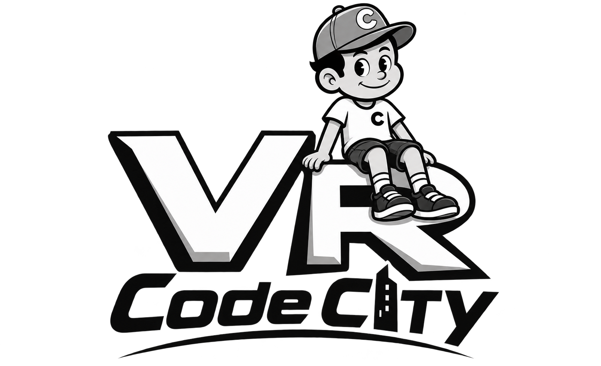
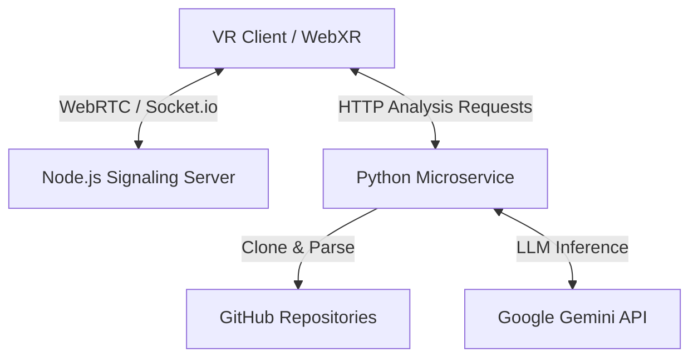

<p align="center">
  
</p>

# VR Code City: Immersive Code Analysis Environment

VR Code City is a multiplayer, shared virtual reality platform developed for the web (WebVR/WebXR). It transforms software analysis into a spatial experience by visualizing GitHub repositories as interactive 3D cities.

In this environment, users can connect together, share presence in real-time, navigate through their codebase, and interact with an advanced AI Agent (**The Oracle**) to understand, debug, and refactor code directly from virtual reality.

## Core Features

### Code City Visualization

- **Spatial Repository Mapping:** Repositories are dynamically cloned and parsed in the backend. Directories become districts (city blocks), and files become buildings.
- **Visual Metrics:** The height of a building represents the Lines of Code (LOC) for that file.
- **X-Ray Vision Mode:** A temporal heatmap mode that alters building colors based on the recency of the last commit, allowing teams to instantly spot active development zones or legacy code.
- **Time Machine:** Travel back in time by checking out previous commits and watching the city restructure itself instantly.

### Explorer Modes

- **Multiplayer Session:** Create or join collaborative rooms to analyze GitHub repositories in a shared live session.
- **Solo Mode (Offline/Dev):** Explore pre-analyzed repository data or upload custom JSON datasets without needing a live backend connection or multiplayer setup. Perfect for isolated code analysis or quick exploration.

### The Oracle (Context-Aware AI Agent)

- **Gaze-Based RAG:** The Oracle is an intelligent floating interface that knows exactly what file you are pointing at in the VR world.
- **Code Explanation & Refactoring:** Ask the Oracle to explain the architecture of the project globally, or point to a specific building to find bugs, explain dependencies, or suggest refactors for that exact file.
- **Powered by Google Gemini:** The AI interactions are seamlessly handled by a dedicated Python microservice leveraging Google's **Gemini API** for rapid and accurate code assistance.

### Multiplayer Collaboration

- **Real-Time Presence:** Powered by WebRTC and Networked-Aframe, users can see each other's avatars (head and hand tracking) seamlessly.
- **Voice Chat & Interaction:** Collaborate with your team as if you were walking through the same physical city, discussing the codebase architecture naturally.

---

## Architecture and Technologies



- **Frontend (3D/VR):** A-Frame, Three.js, HTML5, Vanilla JavaScript, and CSS3.
- **Networking:** Networked-Aframe, Socket.io, and EasyRTC (P2P signaling for low-latency VR).
- **Backend (Analysis & AI):** Python-based service for analyzing repository trees and managing AI context.
- **Backend (Signaling):** Node.js and Express.
- **AI Integration:** Google Gemini API for powerful real-time LLM code inference.

---

## Installation and Local Setup

Follow these steps to run the environment locally:

1. **Clone the repository** to your local machine:

   ```bash
   git clone <your-repository-url>
   cd TFG
   ```

2. **Configure your environment variables:**
   Navigate to the `python-service` directory, create a `.env` file, and add your Gemini API key:

   ```env
   GEMINI_API_KEY=your_gemini_api_key_here
   PYTHON_PORT=8000
   ```

3. **Install Dependencies:**
   - **Node.js Dependencies:**

     ```bash
     npm install
     ```

   - **Python Dependencies:**

     ```bash
     cd python-service
     pip install -r requirements.txt
     cd ..
     ```

4. **Start the local servers:**
   You can start both the Node.js signaling server and the Python microservice simultaneously using:

   ```bash
   npm run start:all
   ```

5. **Access the application:**
   Open a Chromium-based browser and navigate to `http://localhost:8080`.

   > [!NOTE]
   > To enter WebXR using headsets like Meta Quest, a secure HTTPS tunnel (like NGROK) is required, or you must configure a local SSL certificate.

---

## Controls

### Desktop Mode (Keyboard and Mouse)

- **Movement:** `W`, `A`, `S`, `D` keys.
- **Look Around:** Mouse movement.
- **Toggle Oracle:** Press `O` on the keyboard.
- **Pause / Unfocus:** `ESC`.

### Virtual Reality Mode (HMD and VR Controllers)

- **Movement:** Left Joystick (Fly / Walk).
- **Camera Turn (Snap Turn):** Right Joystick.
- **Interact / Select:** Use the laser pointer and right trigger to click on buildings or interfaces.
- **Dashboard:** Toggle with the Left Controller.
- **The Oracle:**
  - **Toggle Interface:** `Y` button (Left Controller).
  
---

## Future Roadmap

The project is under active development. Future iterations aim to integrate deeper static analysis tools, support for larger monolithic repositories with optimized rendering techniques, and richer collaborative AI features for software development teams.
